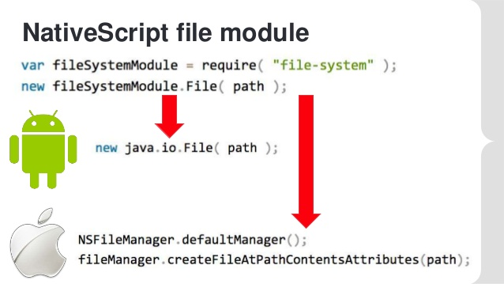
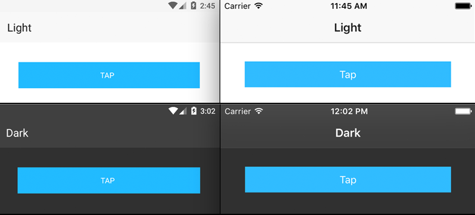
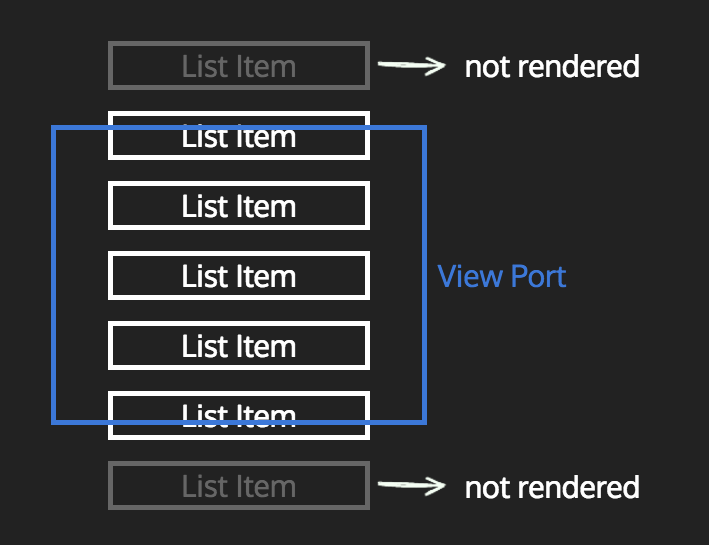
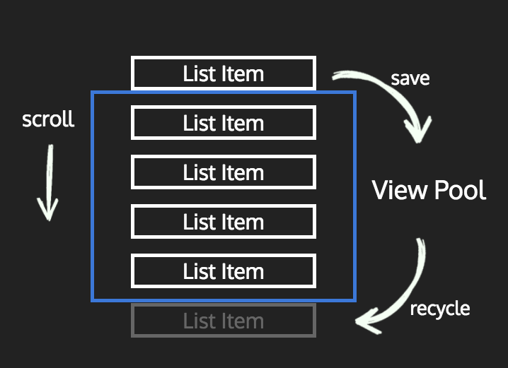

<!-- section start -->
<!-- attr: { id:'title', class:'slide-title', hasScriptWrapper:true } -->
# UI Components
## NativeScript Angular

<div class="signature">
    <p class="signature-course">Mobile Applications with NativeScript</p>
    <p class="signature-initiative">Telerik Software Academy</p>
    <a href="http://academy.telerik.com" class="signature-link">http://academy.telerik.com</a>
</div>


<!-- section start -->
<!-- attr: { id:'table-of-contents' } -->
# Table of Contents
-  UI Components overview
    - [Demo] Ninja application form

- Reactive forms with Angular
    - [Demo] Reactive ninja form

- ListView
    - [Demo] Ninjas list

- SDK examples app

<!-- section start -->
<!-- attr: { class:'slide-section', showInPresentation: true } -->
<!-- # Overview

<!-- attr: { class:'slide', hasScriptWrapper:true, style: 'font-size: 40px;' } -->
# The Basics

- NativeScript ships with a set of [UI views](https://docs.nativescript.org/ui/components)
- Wrappers of the Android and iOS native view
- They provide a **common API** for XML/JS usage

<div style="text-align: center"></div>

<!-- attr: { class:'slide', hasScriptWrapper:true, style: 'font-size: 40px;' } -->
# Theme

- Bootstrap-inspired CSS theme
- Included in every new NativeScript project 
- [Documentation](http://docs.nativescript.org/ui/theme)
<div style="text-align: center"></div>

<!-- attr: { class:'slide-section demo', showInPresentation: true } -->
# Ninja application form
## Live Demo


<!-- section start -->
<!-- attr: { class:'slide-section', showInPresentation: true } -->
<!-- # Angular Forms

<!-- attr: { class:'slide', hasScriptWrapper:true, style: 'font-size: 40px;' } -->
# Template-driven forms

- Forms controls, declared in the component's **template**
- Binded to data model properties by **[(ngModel)]**
- The approach requires different templates for web and native
- [Angular Docs](https://angular.io/docs/ts/latest/guide/forms.html)

```xml
<StackLayout>
    <Label text="Login Page" class="title"></Label>

    <TextField [(ngModel)]="user"
        hint="user"></TextField>
    <TextField [(ngModel)]="pass"
        hint="password" secure="true"></TextField>

    <Button (tap)="login()"
        text="Login"></Button>
</StackLayout>
```


<!-- attr: { class:'slide', hasScriptWrapper:true, style: 'font-size: 40px;' } -->
# Reactive forms

- Forms control objects created with code in the component's **class**
- Binded to native form control elements in the **template**
- Single source of (validation) truth
- [Angular Docs](https://angular.io/docs/ts/latest/guide/reactive-forms.html)

```ts
this.loginForm = this.formBuilder.group({
    user: ["", Validators.required],
    password: ["", [
        Validators.required,
        Validators.minLength(5),
    ]],
});
```
<!-- attr: { class:'slide-section demo', showInPresentation: true } -->
# Reactive ninja form
## Live Demo


<!-- section start -->
<!-- attr: { class:'slide-section', showInPresentation: true } -->
<!-- # ListView

<!-- attr: { class:'slide', hasScriptWrapper:true, style: 'font-size: 40px;' } -->
# UI Virtualization

- Creating views only for the items on the display
<div style="text-align: center"></div>

<!-- attr: { class:'slide', hasScriptWrapper:true, style: 'font-size: 40px;' } -->
# Recycling

- New items reuse the items that were scrolled out of view.
<div style="text-align: center"></div>

<!-- attr: { class:'slide', hasScriptWrapper:true, style: 'font-size: 60px;' } -->
# ListView scrolling

- [How not to ruin performance](https://medium.com/@alexander.vakrilov/faster-nativescript-listview-with-multiple-item-templates-8f903a32e48f)
- Use **[items]** instead of **\*ngFor** for items iteration
- **Don't** use *ngIf inside templates
- **Do use** templateSelectors instead

<!-- attr: { class:'slide-section demo', showInPresentation: true } -->
# Ninjas list
## Live Demo


<!-- section start -->
<!-- attr: { class:'slide-section', showInPresentation: true } -->
<!-- # Resources

- [Demo code](https://github.com/sis0k0/uicomponents-demo)
- [Code samples](http://docs.nativescript.org/angular/code-samples/ui/action-bar.html)
- [Code samples repo](github.com/nativescript/nativescript-sdk-examples-ng)
- [Free video course](https://www.nativescript.org/blog/free-video-training-on-nativescript-javascript-and-nativescript-angular?utm_medium=website&utm_campaign=yellowstrip&utm_source=nativescriptdotorg)
- [NativeScript community slack](http://developer.telerik.com/wp-login.php?action=slack-invitation)


<!-- section start -->
<!-- attr: { class:'slide-section', showInPresentation: true } -->
<!-- # Resources


